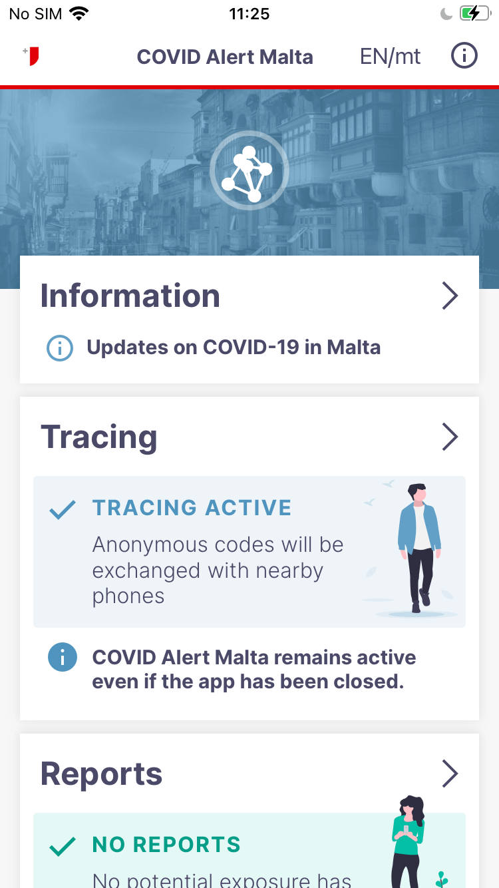
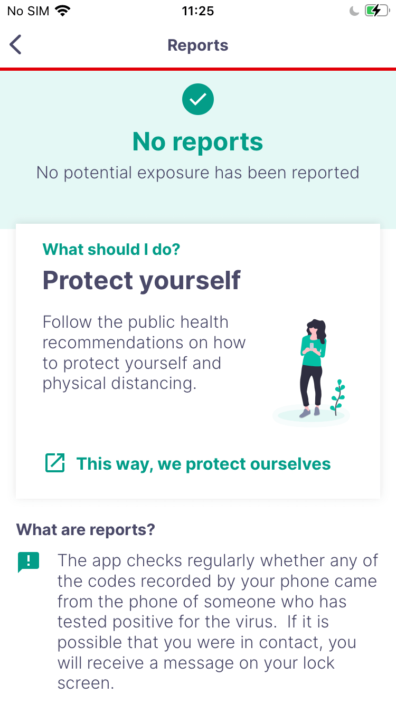
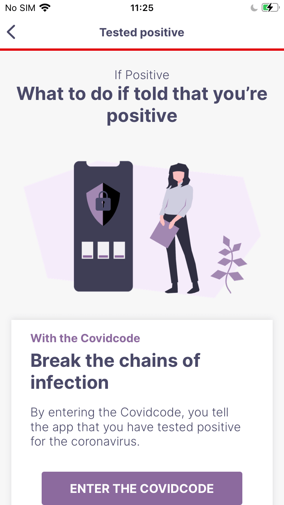
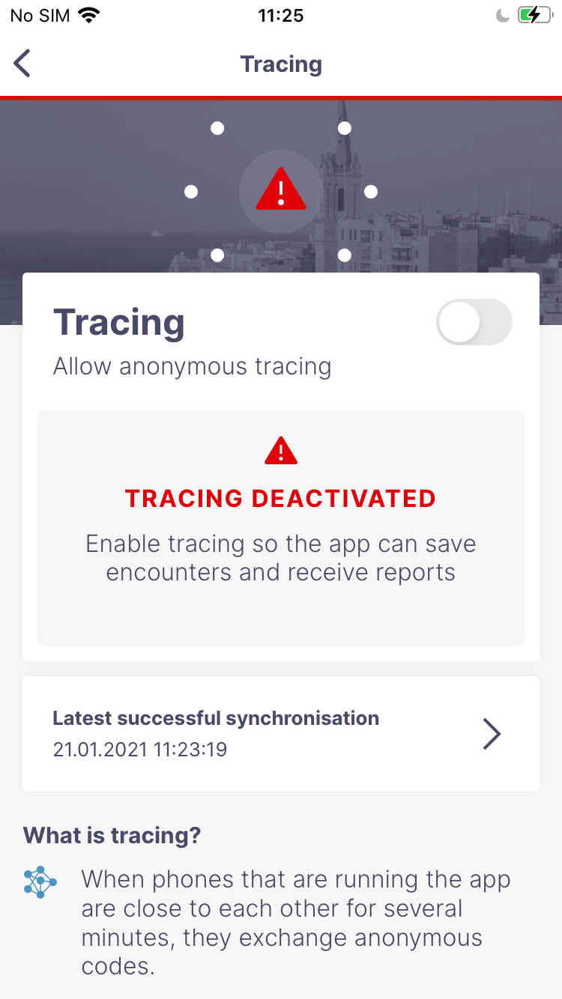
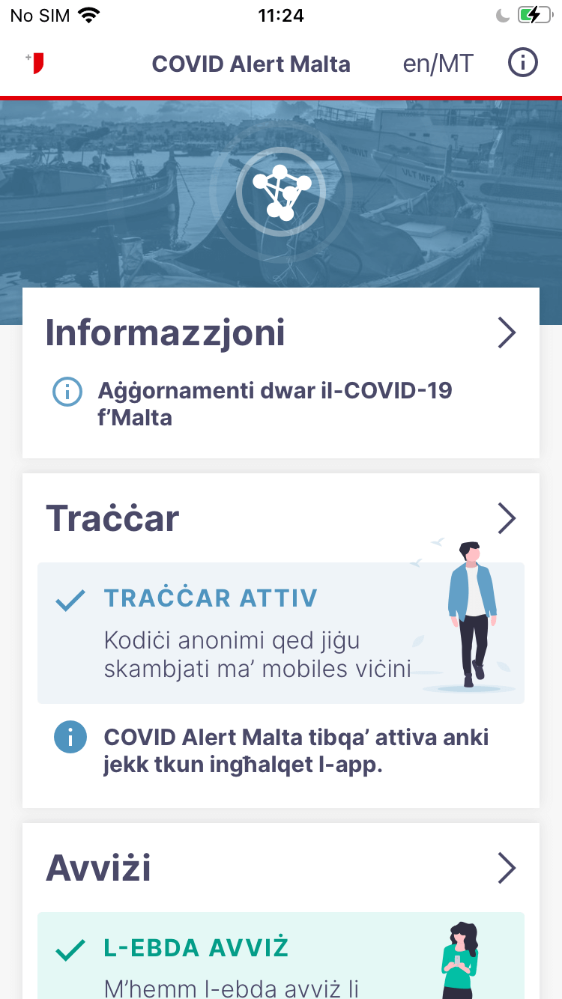
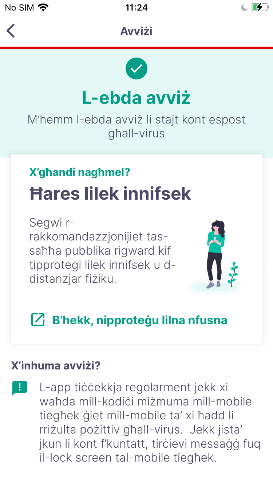
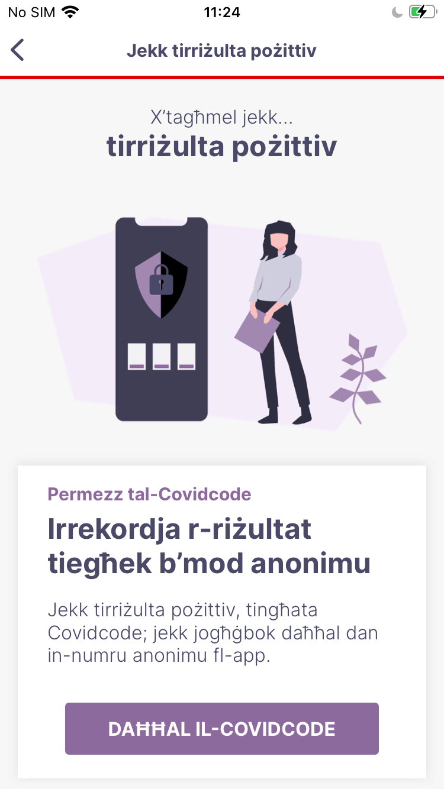
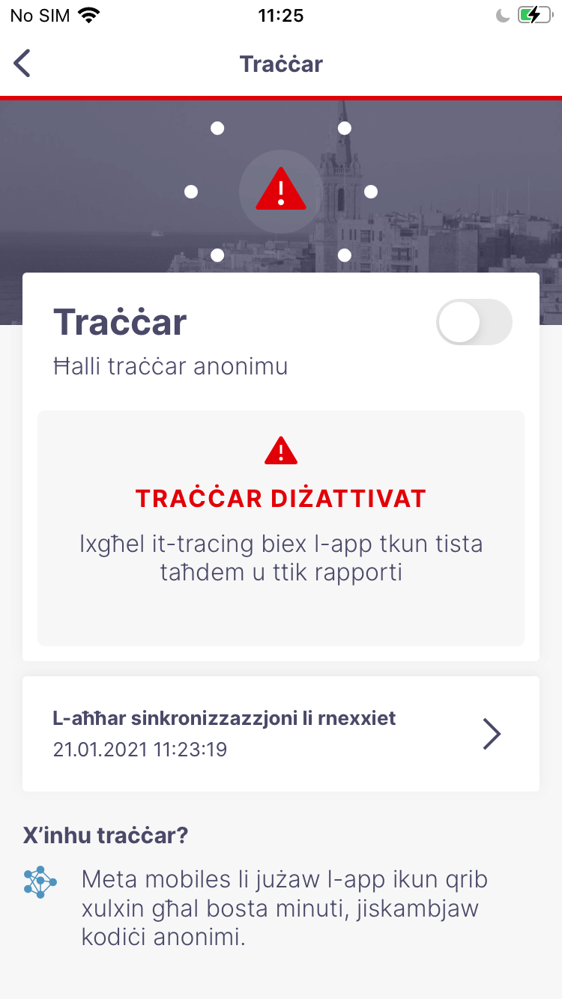

# CovidAlertMT: DP3T iOS App for Malta

## DP3T
The Decentralised Privacy-Preserving Proximity Tracing (DP-3T) project is an open protocol for COVID-19 proximity tracing using Bluetooth Low Energy functionality on mobile devices that ensures personal data and computation stays entirely on an individual's phone. It was produced by a core team of over 25 scientists and academic researchers from across Europe. It has also been scrutinized and improved by the wider community.

DP-3T is a free-standing effort started at EPFL and ETHZ that produced this protocol and that is implementing it in an open-sourced app and server.

## Introduction
CovidAlertMT is a COVID-19 tracing client based on the official COVID-19 tracing solution for Switzerland, with changes and optimisations to accommodate Maltese requirements.

English

Maltese

## Contribution Guide
This project is open-source and we welcome any feedback on the code regarding both the implementation and security aspects.

Bugs or potential problems should be reported using Github issues. Pull requests that improve the quality of the source code are welcomed. 

## Repositories
* Android SDK & Calibration app: [dp3t-sdk-android](https://github.com/DP-3T/dp3t-sdk-android)
* iOS SDK & Calibration app: [dp3t-sdk-ios](https://github.com/DP-3T/dp3t-sdk-ios)
* Android App: [dp3t-app-android](https://github.com/GOVMT-MITA/dp3t-app-android-mt)
* iOS App: [dp3t-app-ios](https://github.com/GOVMT-MITA/dp3t-app-ios-mt)
* Backend SDK: [dp3t-sdk-backend](https://github.com/GOVMT-MITA/dp3t-sdk-backend)

## Further Documentation
The full set of documents for DP3T is at https://github.com/DP-3T/documents. Please refer to the technical documents and whitepapers for a description of the implementation.

A description of the usage of the Apple Exposure Notification API can be found [here](https://github.com/DP-3T/dp3t-sdk-ios/blob/master/EXPOSURE_NOTIFICATION_API_USAGE.md).

## Installation and Building
The project should be opened with the latest Xcode versions, 12.3. Dependencies are managed with [Swift Package Manager](https://swift.org/package-manager), no further setup is needed.

### Provisioning
The project is configured for a specific provisioning profile. To install the app on your own device, you will have to update the settings using your own provisioning profile.

Apples Exposure Notification Framework requires a  `com.apple.developer.exposure-notification` entitlement that will only be available to government entities. You will find more information in the [Exposure Notification Addendum](https://developer.apple.com/contact/request/download/Exposure_Notification_Addendum.pdf) and you can request the entitlement  [here](https://developer.apple.com/contact/request/exposure-notification-entitlement).

## License
This project is licensed under the terms of the MPL 2 license. See the [LICENSE](LICENSE) file.
